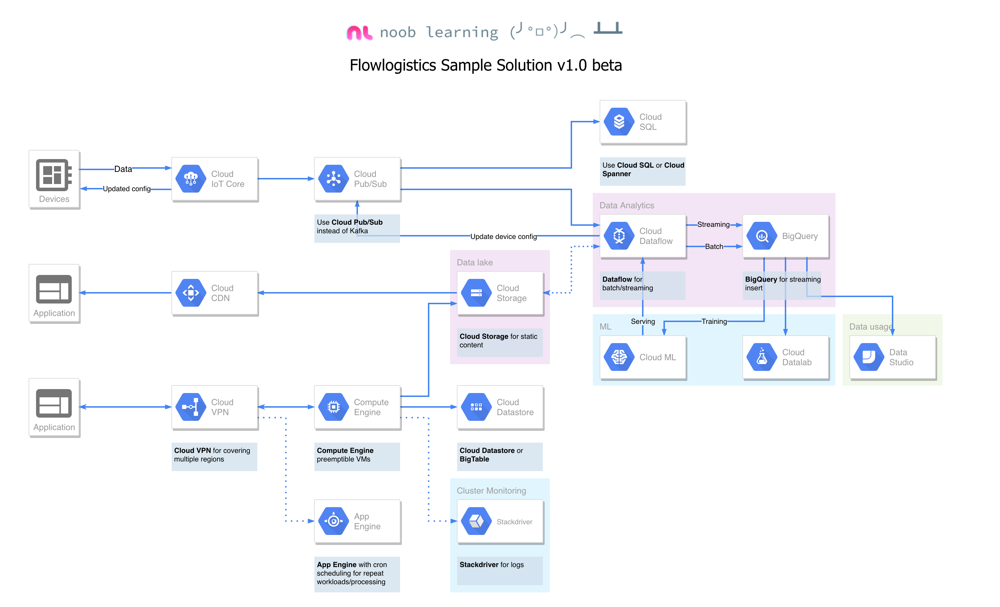

# Flowlogistic Case Study
> https://www.coursera.org/learn/preparing-cloud-professional-data-engineer-exam/supplement/pD4e8/flowlogistic-case-study

## Company Overview
Flowlogistic is a leading logistics and supply chain provider. They help businesses throughout the world
manage their resources and transport them to their final destination. The company has grown rapidly,
expanding their offerings to include rail, truck, aircraft, and oceanic shipping.

## Executive Statement
We started as a regional trucking company, and then expanded into other logistics markets. We penalize
ourselves for late shipments and deliveries, so knowing where our shipments are at all times has a direct
correlation to our bottom line and profitability. To gain that insight, we have built our own proprietary
real-time tracking system that uses telemetry data collected from field assets.

## Solution Concept
Flowlogistic wants to scale up their existing real-time inventory-tracking system to support their current
volumes of data and plan for 10x growth in the next 5 years. They want to perform analytics on all their
orders and shipment logs, which contain both structured and unstructured data, to determine how best to
deploy resources, which customers to target, and which markets to expand into. They also want to be
able to predict when a shipment will be delayed.

## Existing Technical Environment
Flowlogistic’s environment is all on-premises hardware managed by Flowlogistic’s IT.
- Operational system transactions are stored in a 20TB SQL Server environment.
- Metadata as well as tracking and messaging event data are stored in a 750TB NoSQL
environment.
- Message tracking is done via a single Kafka cluster with 10 brokers, processing 1TB of batch
data and 100GB per day on streaming
- 2PB historical data residing on storage appliances
- 10 node Hadoop Cluster with Spark for core analytics.
- Miscellaneous servers
  - Customer front end, middleware for order//customs
  - CI/CD
  - Monitoring, bastion hosts, security scanners, billing software
- Flowlogistic tracks approximately 1 million sensors. These sensors are on delivery vehicles and
attached to some high value cargo items. They are happy with their current ingestion stack but
are assessing how to improve their processing and storage.
- Flowlogistic has up to 10Gbps of network connectivity to the internet, but is heavily utilized and
Flowlogistic may not be able to increase capacity until 6-9 months from now.

## Business Requirements
- Give analysts access to near real-time information about every shipment worldwide.
- Use machine learning to analyze delivery times and delays real time adjustments to routing to
avoid late shipments.
- Better understand routing patterns to create faster routes at the lowest costs.
- Leverage cloud-native technologies to create a future-proof architecture that is scalable and
modular.
- Improve the productivity of IT by removing the constraint of managing and provisioning new
resources as the current infrastructure cannot handle the current load and will not accommodate
expected growth.
- Lower company-wide operational costs by retiring the datacenter and moving entirely to the
cloud.

## Technical Requirements
- Single, centralized platform for all analytics.
- Platform must be able to handle both streaming and batch data.
- Prevent data exfiltration.
- Develop comprehensive security policies to account for differences between moving from the
current on-premise environment to a new cloud-native environment
- Ensure architecture is scalable, elastic and optimized for performance in the Cloud to meet the
changing demands of the company.
- Use managed services whenever possible to limit time spent managing infrastructure.

---

## Propose Solutions
